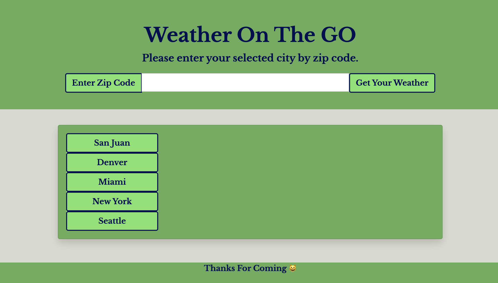
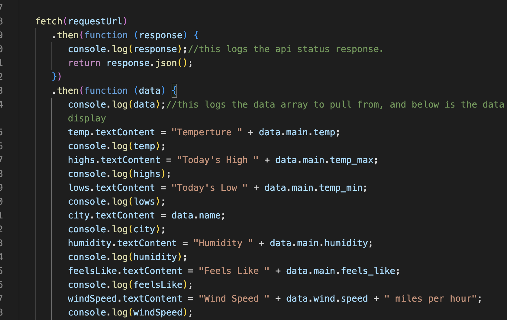
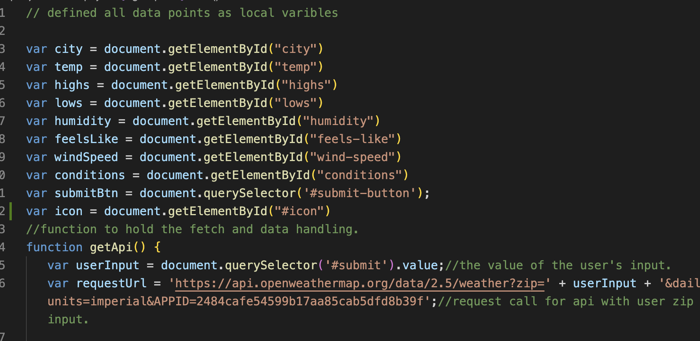
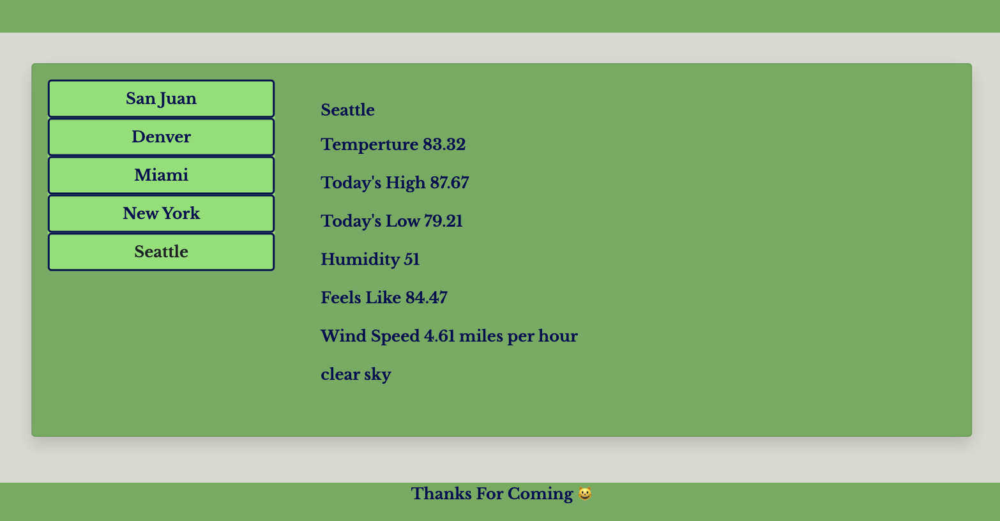

# Weather App 

This week's challenge is to use server side API's to display the current weather of a given city. Users can enter their own zip code to display the weather or choose another city listed. I was unable to get the local storage to log the cities to display together, but I am ok with the functionality at this point. I had a tutor that was a no show and kinda ran out of time to keep asking askBCS. Mike (my TA) did point me in the correct direction, I just never reached the destination. 
*****
[My Deployed Application](https://katsaymeow.github.io/Weather-On-The-Go/)

[My Repository](https://github.com/katsaymeow/Weather-On-The-Go)
****

****
## Steps I took

Well, getting the API to call was the first thing. I actually got a basic call and was able to log it pretty quickly. 
***

***
All week I played around with javascript to get one data point to populate. I had to commented out again and again. I finally asked askBCS for some pointers. It turned out I had my whole function written upside-down. I also had all my variables written in a local scope and they were not being read at all. I was so happy once this was pointed out. 
*** 

*** 
Some of the data I was unable to find to fetch. I could not locate the UV index. It is apparently depreciated with the API now. I also was unable to figure out how to call the 5-day forecast. I really needed my tutor I had scheduled to help me with the documentation. I have the idea it was on a separate API now, but once again ran out of time to vet this completely. 

I was happy to see the data coming through. I was missing the .value after reading my querySelector. Turns out San Juan, Puerto Rico has a type error in its name. 
***

***
## Conclusion

I am getting better at javascript. That is really an accomplishment for me right now. I really needed to figure out why I could not style my populated input the way I wanted. Everything is just there, but I put it off trying to figure out how to use the icon. I just did not know what that was even going to do. I am happy I got this far.
***

## Sources

This week I used askBCS and previous activities more than using online tools. I spend a lot of time figuring it it out for my weather api to display in the html. I had the information, but was not declaring my variables in the correct scope. Once this was pointed out by askBCS, I was able to completely fix that. 

[My Cheerful Font 😺](https://fonts.google.com/specimen/Libre+Baskerville?preview.text=Weather%20On%20The%20Go&preview.text_type=custom)

[Some More Bootstrap, will learn something else now](https://getbootstrap.com/docs/4.5/getting-started/introduction/)

[Using API Keys](https://coding-boot-camp.github.io/full-stack/apis/how-to-use-api-keys)

[One Call Weather API](https://openweathermap.org/api)
